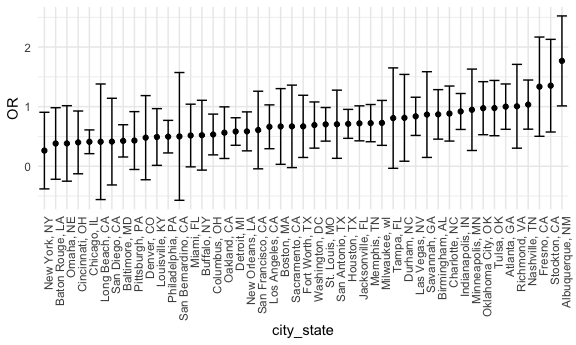
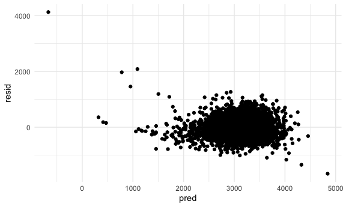
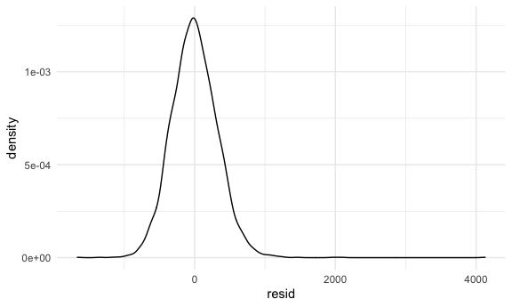
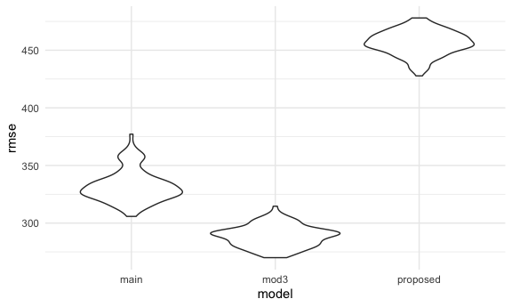
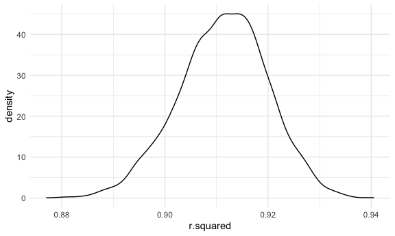
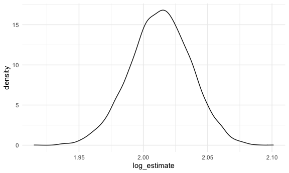

HW6
================

## Problem 1

#### Read in and tidy data

``` r
homicide_df = 
  read_csv("./data/homicide-data.csv", na = c("", "NA", "Unknown")) %>% 
  mutate(
    city_state = str_c(city, state, sep = ", "),
    victim_age = as.numeric(victim_age),
    resolution = case_when(
      disposition == "Closed without arrest" ~ 0,
      disposition == "Open/No arrest" ~ 0,
      disposition == "Closed by arrest" ~ 1
    )
  ) %>% 
  filter(victim_race %in% c("White", "Black"),
    city_state != "Tulsa, AL") %>% 
  select(city_state, resolution, victim_age, victim_race, victim_sex)
```

    ## Parsed with column specification:
    ## cols(
    ##   uid = col_character(),
    ##   reported_date = col_double(),
    ##   victim_last = col_character(),
    ##   victim_first = col_character(),
    ##   victim_race = col_character(),
    ##   victim_age = col_double(),
    ##   victim_sex = col_character(),
    ##   city = col_character(),
    ##   state = col_character(),
    ##   lat = col_double(),
    ##   lon = col_double(),
    ##   disposition = col_character()
    ## )

#### Do this for one city…

``` r
baltimore_df = 
  homicide_df %>% 
  filter(city_state == "Baltimore, MD")

glm(resolution ~ victim_age + victim_race + victim_sex, 
    data = baltimore_df, 
    family = binomial()) %>% 
  broom::tidy() %>% 
  mutate(
    OR = exp(estimate),
    CI_lower = (exp(estimate) - 1.96 * std.error),
    CI_upper = (exp(estimate) + 1.96 * std.error)
  ) %>% 
  select(term, OR, starts_with("CI")) %>% 
  knitr::kable(digits = 3)
```

| term              |    OR | CI\_lower | CI\_upper |
| :---------------- | ----: | --------: | --------: |
| (Intercept)       | 1.363 |     1.028 |     1.699 |
| victim\_age       | 0.993 |     0.987 |     1.000 |
| victim\_raceWhite | 2.320 |     1.978 |     2.663 |
| victim\_sexMale   | 0.426 |     0.155 |     0.696 |

#### Do this for all cities

``` r
models_results_df = 
  homicide_df %>% 
  nest(data = -city_state) %>% 
  mutate(
    models = 
      map(.x = data, 
                 ~glm(resolution ~ victim_age + victim_race + victim_sex, data = .x, family = binomial())),
    results = map(models, broom::tidy)
  ) %>% 
  select(city_state, results) %>% 
  unnest(results) %>% 
  mutate(
    OR = exp(estimate),
    CI_lower = (exp(estimate) - 1.96 * std.error),
    CI_upper = (exp(estimate) + 1.96 * std.error)
  ) %>% 
  select(city_state, term, OR, starts_with("CI"))
```

#### Plot

``` r
models_results_df %>% 
  filter(term == "victim_sexMale") %>% 
  mutate(city_state = fct_reorder(city_state, OR)) %>% 
  ggplot(aes(x = city_state, y = OR))+
  geom_point()+
  geom_errorbar(aes(ymin = CI_lower, ymax = CI_upper))+
  theme(axis.text.x = element_text(angle = 90, hjust = 1))
```



## Problem 2

#### Read in and tidy data

``` r
baby_df = 
  read.csv("./data/birthweight.csv") %>% 
  mutate(
    babysex = as.factor(babysex),
    frace = as.factor(frace),
    malform = as.factor(malform),
    mrace = as.factor(mrace)
  )
  
any(is.na(baby_df))
```

    ## [1] FALSE

The four categorical variables (sex of baby, race of father, race of
mother, presence of malformation) have been converted from numeric to
factor. There appears to be no missing data in this dataset.

#### Looking at my proposed model

``` r
proposed_model = lm(bwt ~ blength + gaweeks + babysex + wtgain, data = baby_df)
broom::glance(proposed_model)
```

    ## # A tibble: 1 x 12
    ##   r.squared adj.r.squared sigma statistic p.value    df  logLik    AIC    BIC
    ##       <dbl>         <dbl> <dbl>     <dbl>   <dbl> <dbl>   <dbl>  <dbl>  <dbl>
    ## 1     0.586         0.586  330.     1535.       0     4 -31334. 62680. 62719.
    ## # … with 3 more variables: deviance <dbl>, df.residual <int>, nobs <int>

``` r
broom::tidy(proposed_model) %>% 
  select(-std.error, -statistic) %>% 
  knitr::kable(digits = 3)
```

| term        |   estimate | p.value |
| :---------- | ---------: | ------: |
| (Intercept) | \-4227.348 |    0.00 |
| blength     |    125.296 |    0.00 |
| gaweeks     |     25.809 |    0.00 |
| babysex2    |   \-17.106 |    0.09 |
| wtgain      |      4.482 |    0.00 |

``` r
baby_df %>% 
  add_predictions(proposed_model) %>% 
  add_residuals(proposed_model) %>% 
  ggplot(aes(x = pred, y = resid))+
  geom_point()
```



``` r
baby_df %>% 
  add_residuals(proposed_model) %>% 
  ggplot(aes(x = resid))+ 
  geom_density()
```



I thought it would be interesting to look at how sex of the baby and
weight gain during pregnancy, in addition to the main effects of
gestational weeks and length of baby at birth, would be related to the
baby’s birth weight. I know there are old wives’ tales about how babies
assigned male at birth tend to make women gain more weight in pregnancy,
so I thought that it could be good to look into how each of these relate
to birth weight.

The scatterplot with predictions and residuals shows a few outliers, so
I did a density plot to check the distribution of the residuals. The
distribution looks quite normal, but the tail is quite a bit longer in
the positive direction.

#### Building models, calculating RMSEs for each model, and making violin plots

``` r
main_effects_model = lm(bwt ~ blength + gaweeks, data = baby_df)
proposed_model = lm(bwt ~ babysex + gaweeks + wtgain, data = baby_df)
model_3 = lm(bwt ~ bhead + blength + babysex + bhead*blength + bhead*babysex + blength*babysex +
               bhead*blength*babysex, data = baby_df)


cv_df = 
  crossv_mc(baby_df, 100) %>% 
  mutate(
    train = map(train, as_tibble),
    test = map(test, as_tibble)
  )

cv_df = 
  cv_df %>% 
  mutate(
    main_effects_model = map(.x = train, ~lm(bwt ~ blength + gaweeks, data = .x)),
    proposed_model= map(.x = train, ~ lm(bwt ~ babysex + gaweeks + wtgain, data = .x)),
    model_3 = map(.x = train, ~lm(bwt ~ bhead + blength + babysex + bhead*blength + bhead*babysex + 
                                    blength*babysex + bhead*blength*babysex, data = .x))
  ) %>% 
  mutate(
    rmse_main = map2_dbl(.x = main_effects_model, .y = test, ~rmse(model = .x, data = .y)),
    rmse_proposed = map2_dbl(.x = proposed_model, .y = test, ~rmse(model = .x, data = .y)),
    rmse_mod3 = map2_dbl(.x = model_3, .y = test, ~rmse(model = .x, data = .y))
  )

cv_df %>% 
  select(starts_with("rmse")) %>% 
  pivot_longer(
    everything(),
    names_to = "model",
    values_to = "rmse",
    names_prefix = "rmse_"
  ) %>% 
  ggplot(aes(x = model, y = rmse)) +
  geom_violin()
```



Model 3 has by far the lowest RMSEs, which indicates that this is the
best model to fit the data. My proposed model is by far the worst in
terms of RMSEs, so I will not try to enter the job field of model
building.

## Problem 3

#### Loading in data according to instructions in HW document.

``` r
weather_df = 
  rnoaa::meteo_pull_monitors(
    c("USW00094728"),
    var = c("PRCP", "TMIN", "TMAX"), 
    date_min = "2017-01-01",
    date_max = "2017-12-31") %>%
  mutate(
    name = recode(id, USW00094728 = "CentralPark_NY"),
    tmin = tmin / 10,
    tmax = tmax / 10) %>%
  select(name, id, everything())
```

    ## Registered S3 method overwritten by 'hoardr':
    ##   method           from
    ##   print.cache_info httr

    ## using cached file: /Users/megantebbenhoff/Library/Caches/R/noaa_ghcnd/USW00094728.dly

    ## date created (size, mb): 2020-10-05 15:37:03 (7.522)

    ## file min/max dates: 1869-01-01 / 2020-10-31

#### I am going to get estimates for `r.squared` first.

``` r
weather_model = lm(tmax ~ tmin, data = weather_df)


r_squared = 
  weather_df %>% 
  bootstrap(5000, id = "strap_number") %>% 
  mutate(
    models = map(.x = strap, ~lm(tmax ~ tmin, data = .x)), 
    results = map(models, broom::glance)
  ) %>% 
  select(strap_number, results) %>% 
  unnest(results) %>% 
  select(r.squared)

r_squared %>% 
  summarize(
    ci_lower = quantile(r.squared, 0.025),
    ci_upper = quantile(r.squared, 0.975)
  ) %>% 
  knitr::kable(digits = 3)
```

| ci\_lower | ci\_upper |
| --------: | --------: |
|     0.894 |     0.927 |

``` r
r_squared %>% 
  ggplot(aes(x = r.squared))+
  geom_density()
```



First, I produced 5000 `r.squared` estimates using bootstrapping. Then,
I created a data frame with the 95% confidence interval for these
estimates. Lastly, I modeled the values obtained in a density plot,
which seems mostly normal. Based on the plot, the `r.squared` values
appear to be centered around 0.91, with a 95% confidence interval of
roughly 0.89-0.93.

#### Next, I need to get the log of the product of beta 1 and beta 0.

``` r
log = 
  weather_df %>% 
  bootstrap(5000, id = "strap_number") %>% 
  mutate(
    models = map(.x = strap, ~lm(tmax ~ tmin, data = .x)), 
    results = map(models, broom::tidy)
  ) %>% 
  select(strap_number, results) %>% 
  unnest(results) %>% 
  select(strap_number, term, estimate) %>% 
  pivot_wider(
               names_from = term,
               values_from = estimate
               ) %>% 
  janitor::clean_names() %>% 
  summarize(
    log_estimate = log(intercept*tmin)
  )

log %>% 
  summarize(
    ci_lower = quantile(log_estimate, 0.025),
    ci_upper = quantile(log_estimate, 0.975)
  ) %>% 
  knitr::kable(digits = 3)
```

| ci\_lower | ci\_upper |
| --------: | --------: |
|     1.966 |     2.058 |

``` r
log %>% 
  ggplot(aes(x = log_estimate))+ 
  geom_density()
```



First, I isolated the intercept (b0) and tmin (b1) values and calculated
the log of the product of them. Then, I made a table of the 95%
confidence interval across those values. Finally, I made a density plot
of these log product values. This plot has a relatively normal
distribution, with a longer left tail than right. The values seem to be
centered around 2.2, with a 95% confidence interval of roughly
1.96-2.06.
